# Desafio Técnico API REST - Pior Filme do Golden Raspberry Awards

- Essa API permite utilizar uma base importada de um arquivo CSV para gerar e disponibilizar dados
sobre indicados e vencedores do referido prêmio.

- Um dos principais objetivos dessa API é obter o produtor com maior intervalo entre dois prêmios consecutivos, e o que
  obteve dois prêmios mais rápido. A aprensentação desses dados seque a especificação no arquivo src/main/resources/files/Especificação Backend.pdf.

# Características da API

- API desenvolvida usando Quarkus Framework na versão 3.3.2
  - A estrutura inicial do projeto foi gerada pelo START CODING do quarkus (https://code.quarkus.io/)
- Ao iniciar a aplicação, o arquivo CSV presente no diretório src/main/resources/files/movielist.csv é lido, processado e seus dados são armazenados no banco de dados.
- Utilização de SGBD embarcado H2
- Documentação com Swagger
- Autenticação e Autorização de requisições usando método de autenticação básica. (Será detalhado mais a frente) 
- Disponibilização de rota para obter o produtor com maior intervalo entre dois prêmios consecutivos, e o que obteve dois prêmios mais rápido.
- As especificações do teste técnico apresentado no documento src/main/resources/files/Especificação Backend.pdf citam a criação de uma API API RESTful. Portando, algumas rotas adicionais foram criadas para simular a aproximação desse padrão solicitado. No decorrer da leitura desse documento será explicado do que se trata essas rotas adicionais.

# Tecnologias necessárias para execução do projeto

- Java - Versão 11. Disponível em: https://docs.aws.amazon.com/corretto/latest/corretto-11-ug/downloads-list.html
- Maven - Versão 3.9.4. Disponível em: https://dlcdn.apache.org/maven/maven-3/3.9.4/source/apache-maven-3.9.4-src.zip
- Se necessário, A SDK do java e o Maven usados para execução da aplicação estão disponíveis no link: https://drive.google.com/drive/folders/1YlBRBejkEQ1FW5CJEUrov1tkdmFIC4_p?usp=sharing

# Passos para executar o projeto utilizando linhas de comandos (Ambiente Windows)

- O primeiro passso aqui é ter o Java e o Maven configurados nas variavéis de ambiente do windows.
- Acesse as configurações de variáveis de ambiente
- 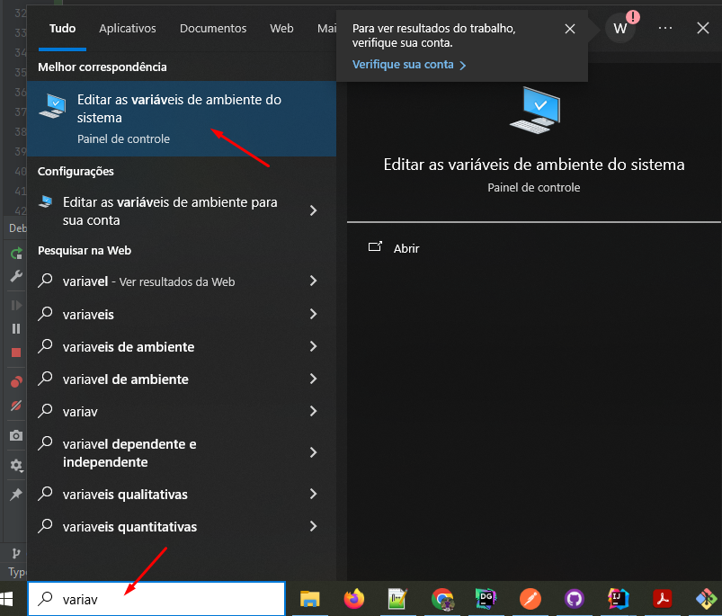
- 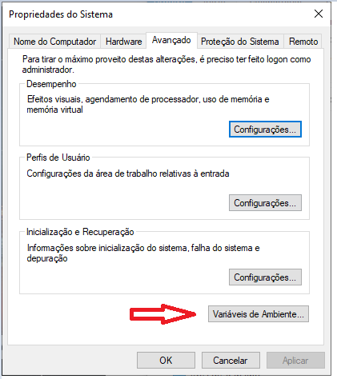
- Na parte de variáveis do sistema, clique em Novo e configure os diretórios onde estão o JAVA e o MAVEN da seguinte forma:
- 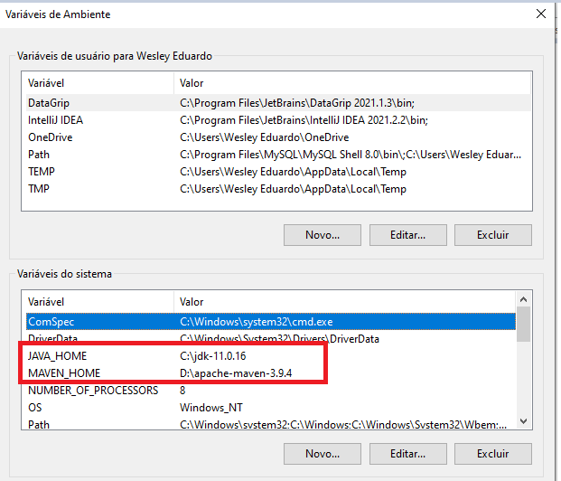
- Faça uma edição no Path para configurar o bin:
- 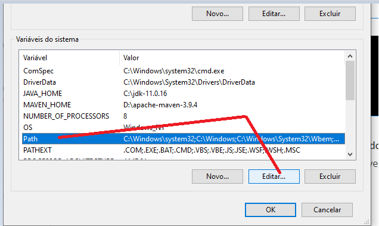
- 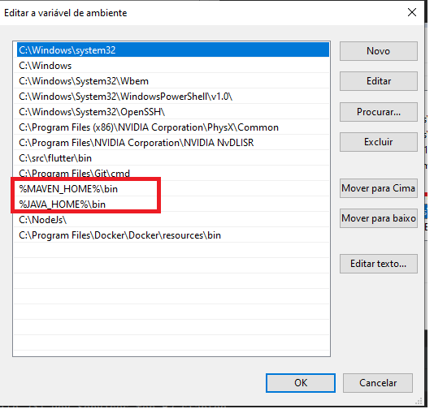
- Clique em OK em todas as telas para encerrar a configuração
- Para testar a configuração do Java abra o cmd e digite: **java -version**
- 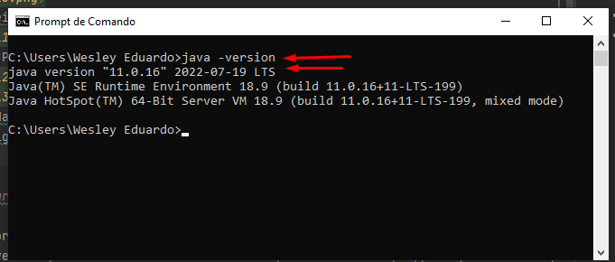
- Para testar a configuração do Maven abra o cmd e digite: **mvn**
- 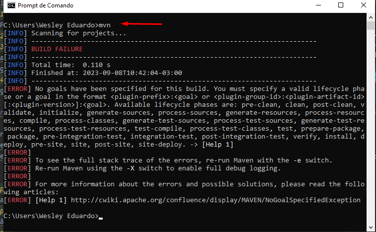
- Agora vamos executar alguns comandos para iniciar a aplicação
- Abra o diretório raiz do projeto clonado e abra como um terminal do GitBash por exemplo. Link downnload GitBash: https://git-scm.com/downloads
- 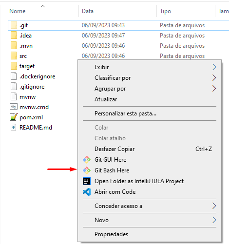
- 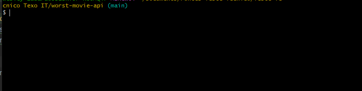
- Execute o comando **mvn clean install** para gerar o build completo da aplicação, inclusive com os testes.
- 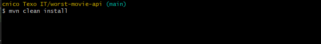
- Devemos ter o seguinte resultado:
- 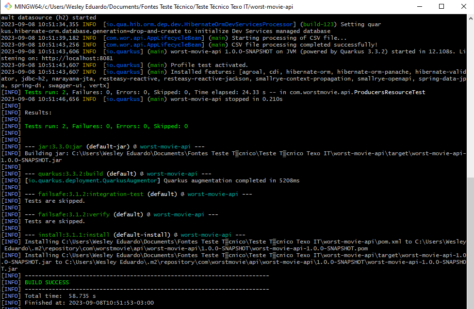
- Para finalmente iniciar a aplicação. Execute o seguinte comando: **./mvnw compile quarkus:dev**
- Temos como resultado:
- 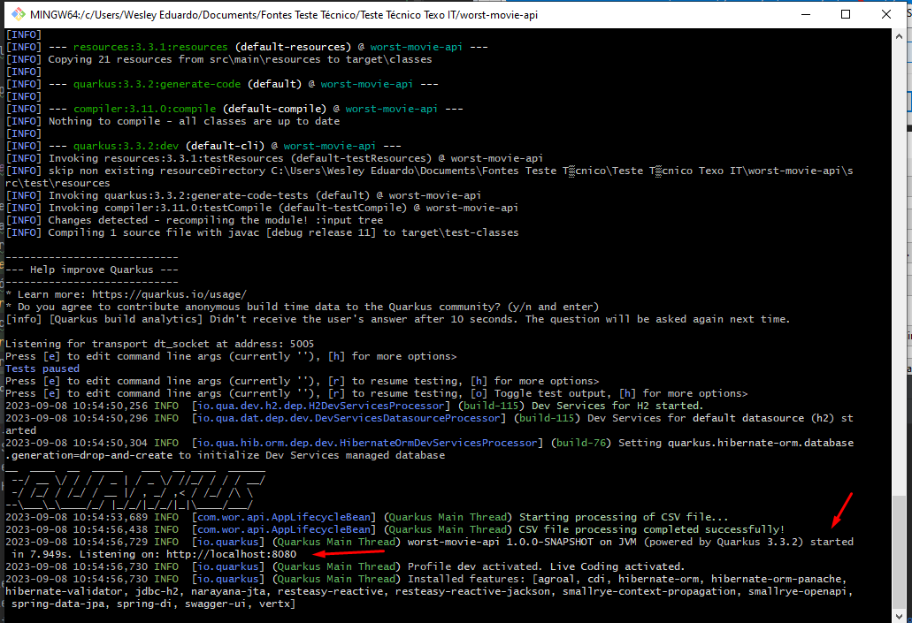
- Utilize o seguinte link acessar o Dashboard do Quarkus: http://localhost:8080
- Link do Swagger http://localhost:8080/q/swagger-ui/
- 

# Passos para executar o projeto utilizando IntelliJ IDEA no idioma inglês

- Clonar o projeto **[worst-movie-api](https://github.com/wesleyeduardodev/worst-movie-api.git)** em algum diretório na máquina. (Para essa aplicação foi usado Windows como ambiente de desenvolvimento)
- Baixar e instalar versão gratuita IntelliJ IDEA Ultimate por 30 dias. https://www.jetbrains.com/idea/download/?section=windows
- Ao iniciar a IDE, selecionar a Opção File -> Open
- 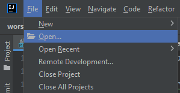
- Procure e selecione o diretório onde o projeto foi clonado:
- 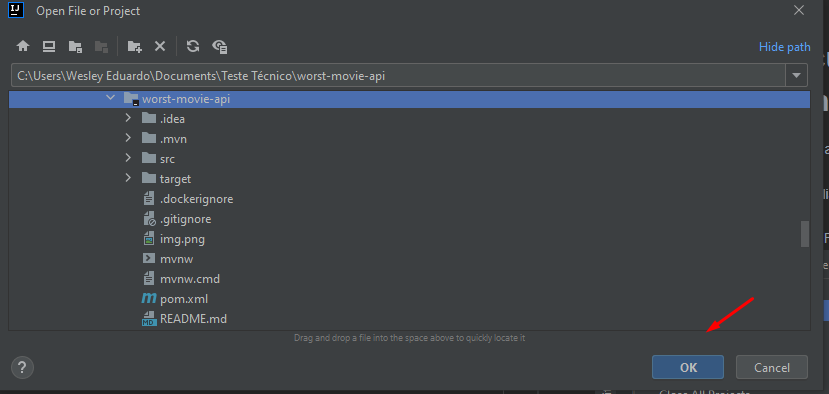
- Para configurar o Java selecione a opção File -> Project Structure
- 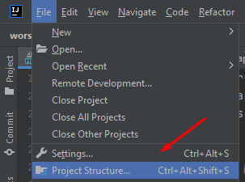
- Na aba project, opção SDK procure e selecione a SDK do Java 11 presente no diretório da sua máquina
- 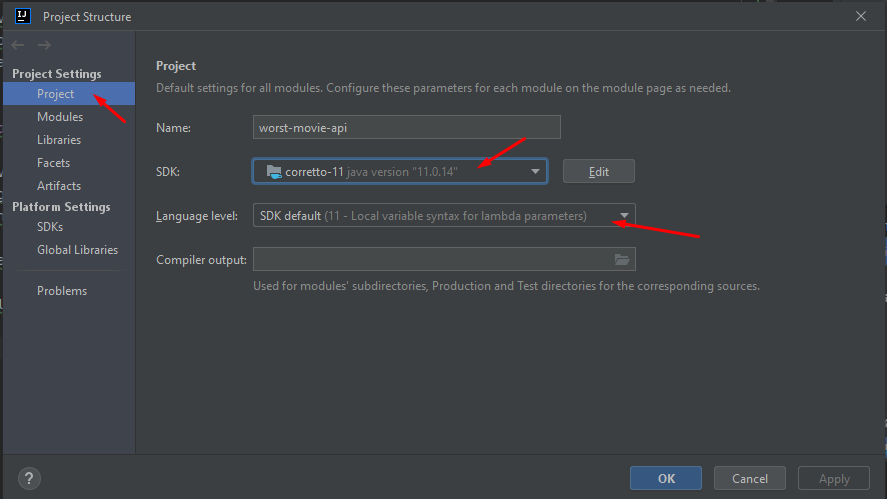
- Para configurar o maven, selecione a opção File -> Settings
- 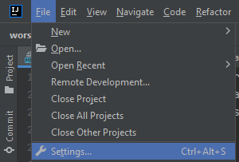
- Pesquisar por maven e configure conforme imagem
- 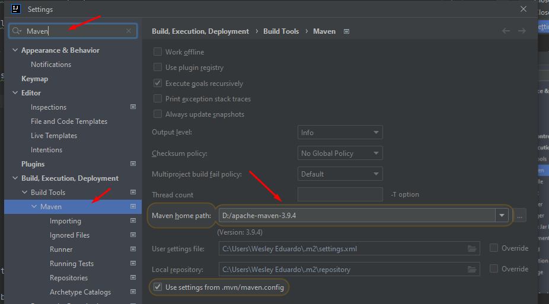
- Na aba do maven na parte superior da lateral direita, execute o clean e install para baixar as dependências do projeto.
- 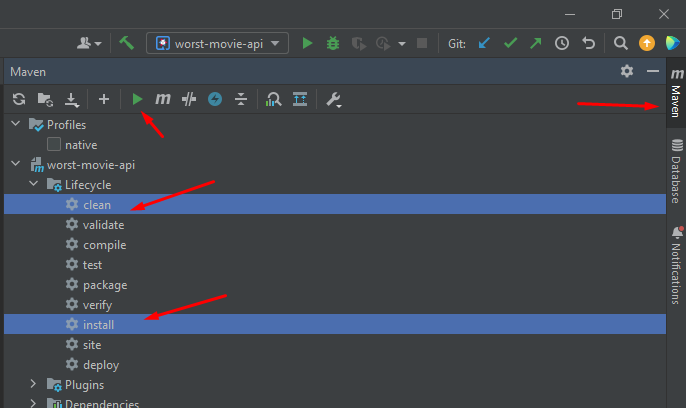
- Após finalizar com sucesso essa ação. na parte superior da lateral direita, clique no botão para executar o projeto:
- 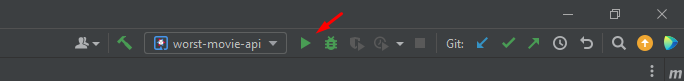
- Utilize o seguinte link acessar o Dashboard do Quarkus: http://localhost:8080 
- Link do Swagger http://localhost:8080/q/swagger-ui/
- 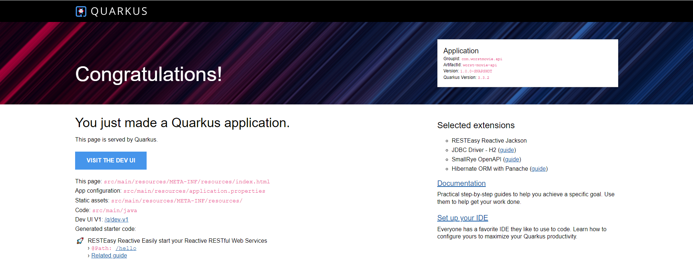 

# Funcionamento do esquema de segurança nas requisições

- Antes de explicar como testar as requisições que retornam a faixa de prêmio e entre outras, farei uma explicação básica do esquema de segurança adotado para essa API, pois alguns endpoints precisam que sejam informados dados de autenticação. 
- O método de segurança adotado foi o basicAuth. Esse método exige que seja passado no Authorization Header da requisição os dados de usuário e senha.
- A definição de dados de usuário e senha foi definido no application.properties da seguinte forma:
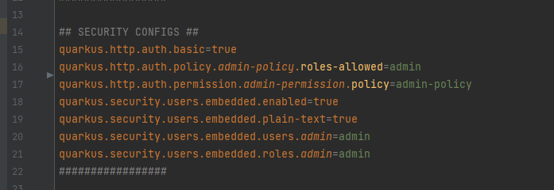
- Nesse caso temos um "Usuário fictício" chamado de "admin" e com senha de "admin". Além disso ele também possui um perfil(role) chamado de "admin". Esse perfil serve para indicar se determinado usuário possuí ou não autorização para acessar um endpoint.
- **Todas as rotas da API do tipo GET estão livres** da necessidade de informar dados de usuário e senha. Isso foi definido usando a anotação @PermitAll nesses endpoints.
- Para as **rotas que realizam operações de create/update e delete**, a anotação @RolesAllowed("admin") foi usada para que exiga que seja passado no Authorization Header os dados de usuário e senha. Além disso essa anotação valida se o usuário tem a role "admin". Pois caso o valor fosse diferente do cadastrado no application.properties para o user "admin"", a requisição retornaria 403 forbidden. Caso seja passado um usuário senha diferente de "admin" e "admin", respectivamente, a requisição retornará 401 unauthorized.
- Para testar uma requição em um endpoint seguro usando o Swagger, faremos da seguinte forma: Após iniciar a aplicação, acesso o Swagger no link: http://localhost:8080/q/swagger-ui/
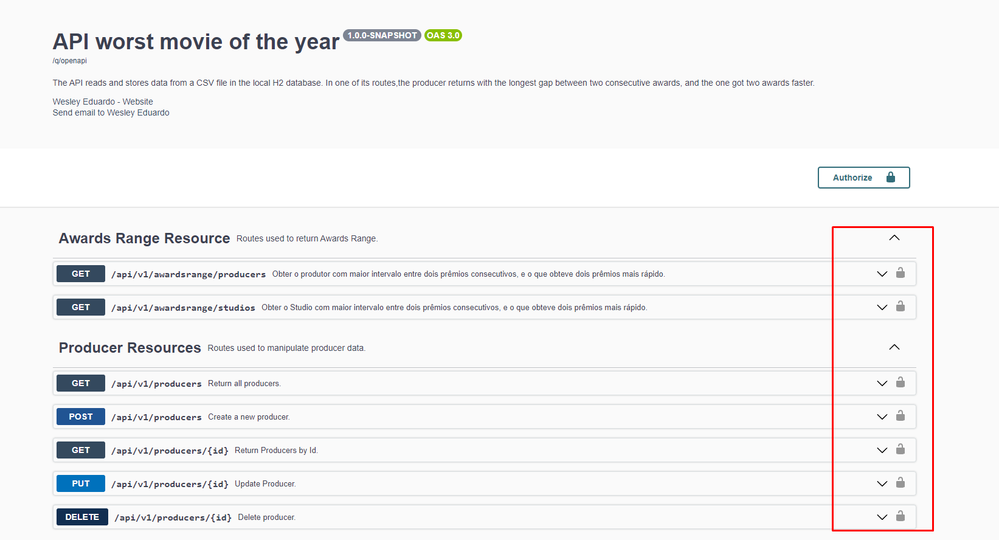
- Observe acima que Swagger já indica quais os endpoints tem caracteristicas de autenticação
- Ao clicar no símbolo do cadeado será exibido a seguinte tela:
- 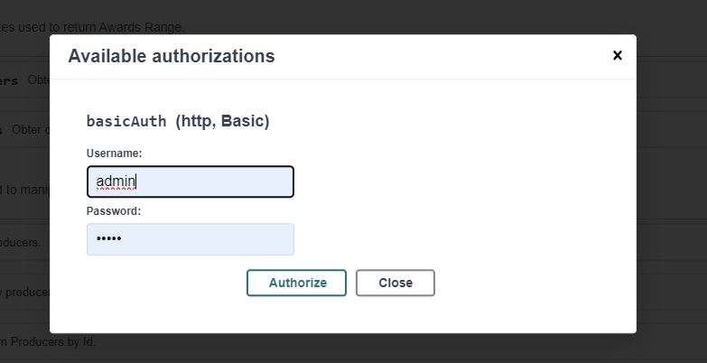
- Nos campos Username e Password informe "admin", depois clique em Authorize, ficando da seguinte forma:
- 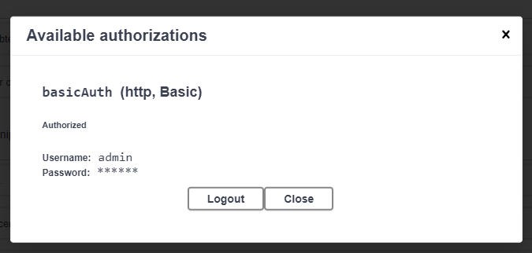
- Após isso é só fechar ver que os cadeados mudaram sua forma visual.
- 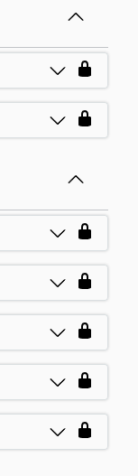
- A exibição do cadeado fechado não indica que os dados informados estão realmente válidos, pois caso tenha sido informado outros tipos de dados a requisição retornaria erro de autorização.
- Após realizar essa configuraçao já é possível realizar requisições com segurança. Reforço que todas as rotas do tipo GET não precisam de dados de autenticação, mas as demais sim.
- Nota: Em aplicações reais existem outras maneiras de configurar a parte de sugurança que são ainda mais seguras, como autenticação e autorização usando JWT em conjunto com um SSO, como por exemplo o Keycloak.
- A configuração usada aqui foi a mais simples possível apenas para atender uma caraterisca basica para qualquer api, que é a segurança da mesma.
- Para essa API, nenhuma configuração de CORS foi usada, tendo todas as requisições liberadas para qualquer cliente consumidor do serviço.
- No caso do uso do Postman para ferramenta de testes de requisição, informe os dados de usuário e senha usando a seguinte configuração abaixo:
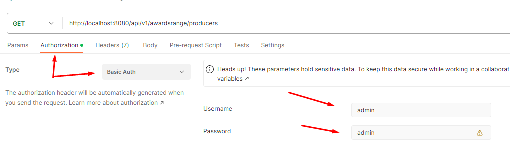

# Passos para retorna faixa de prêmio entre os produtores (Teste com Swagger).

- Para todos os testes explicados aqui por diante, leve em consideração sempre passar os dados de autenticação de usuário onde for necessário.
- O resultado do teste referente a faixa de prêmios considera os dados importados do arquivo CSV presente no diretório src/main/resources/files/movielist.csv.
- Alterações de dados realizados após essa importação, através de manipulação de dados no banco deve ser feito com atenção, pois pode alterar a perspectiva do teste.
- Para gerar outros cenários de testes podem ser feitas várias alterações no arquivo CSV desde que não seja alterado a estruta adequada para um arquivo CSV e nem seja removido os títulos que representam as colunas do CSV. (year;title;studios;producers;winner). Para esses cenários de errros de importação, um log será exibido no console com a característica do erro.
- Inicialize a aplicação conforme já detalhado.
- Acesse o Swagger através do link: http://localhost:8080/q/swagger-ui/
- Procure pelo menu Awards Range Resource
- O menu irá conter a esspecificação da rota a ser usada para retornar o objetivo em questão. Clique na opção "Try it out", conforme imagem:
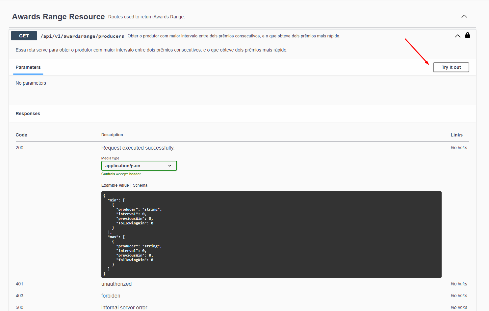
- Agora clique em "Execute"
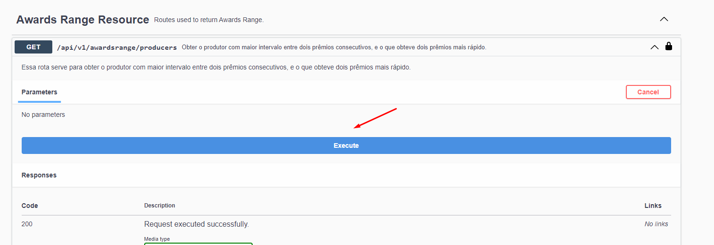
- O resultado é mostrado conforme imagem:
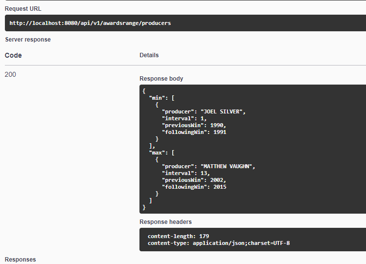
- Veja que tivemos como resultado que o produtor JOEL SILVER foi o que obteve o dois prêmios mais rápido, e o produtor "MATTHEW VAUGHN foi o que teve maior intervalo entre dois prêmios consecutivos
- Reforço que caso a aplicação seja iniciada com alterações de dados no arquivo CSV, e resultado do teste terá grandes chances de serem diferentes e isso deve ser levando em consideração.

# Passos para retornar a faixa de prêmio entre os produtores (Teste com Postman).

- Outra maneira de testar o endpoint que retorna o objetivo em questão, é fazendo uma requisição usando o Postman. Link download: https://www.postman.com/downloads/
- Para todos os testes explicados aqui por diante, leve em consideração sempre passar os dados de autenticação de usuário onde for necessário.
- Inicialize a aplicação conforme já detalhado.
- Após a instalação da ferramenta, abra e crie uma Requisição GET para realizar o teste. (Lembre de passar os dados de usuário e senha na aba Authorization) 
- Utilize a seguinte URL para acessar o Endpoint: http://localhost:8080/api/v1/awardsrange/producers
- Clique em Send para obter o resultado conforme abaixo
- 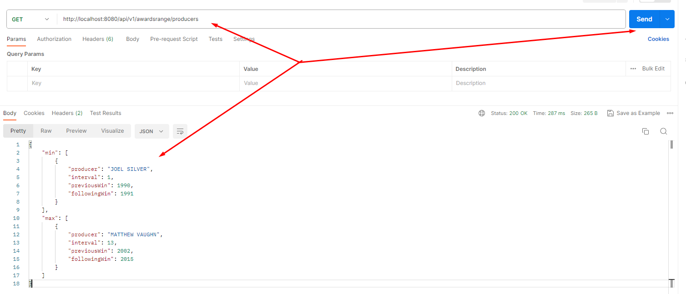
- Veja que tivemos como resultado que o produtor JOEL SILVER foi o que obteve o dois prêmios mais rápido, e o produtor "MATTHEW VAUGHN foi o que teve maior intervalo entre dois prêmios consecutivos
- Reforço que caso a aplicação seja iniciada com alterações de dados no arquivo CSV, e resultado do teste terá grandes chances de serem diferentes e isso deve ser levando em consideração.

# Passos para executar os testes de integração

- Para testar usando o Dashboard do Quarkus, inicialize a aplicação conforme já detalhado.
- Acessando o link: http://localhost:8080
- 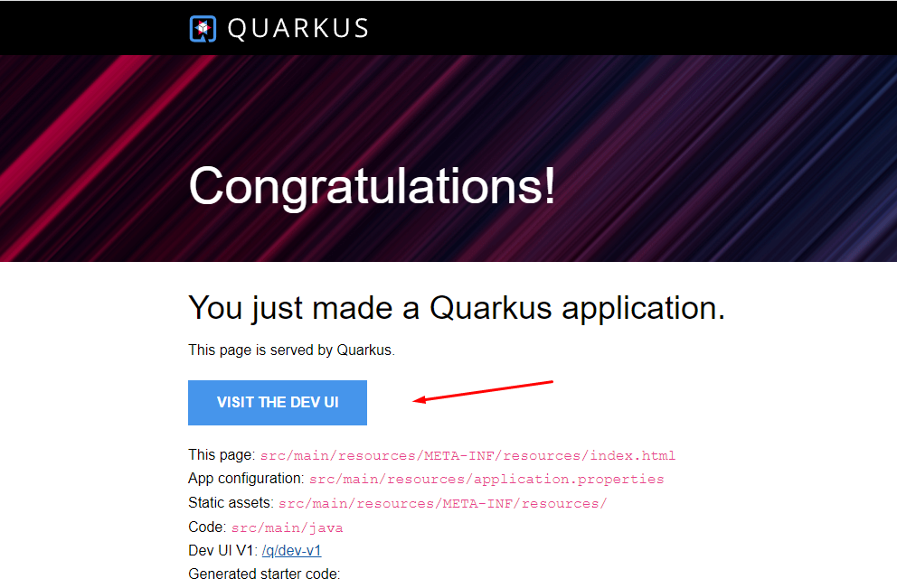
- Clique em "VISIT THE DEV UI"
- Selecione a aba "Continuos Testing" e clique em Start
- 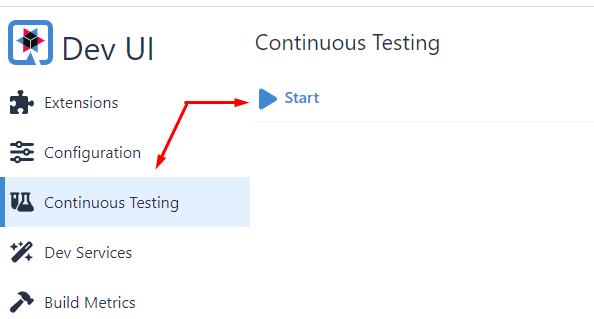
- O resultado dos testes é apresentado conforme imagem
- 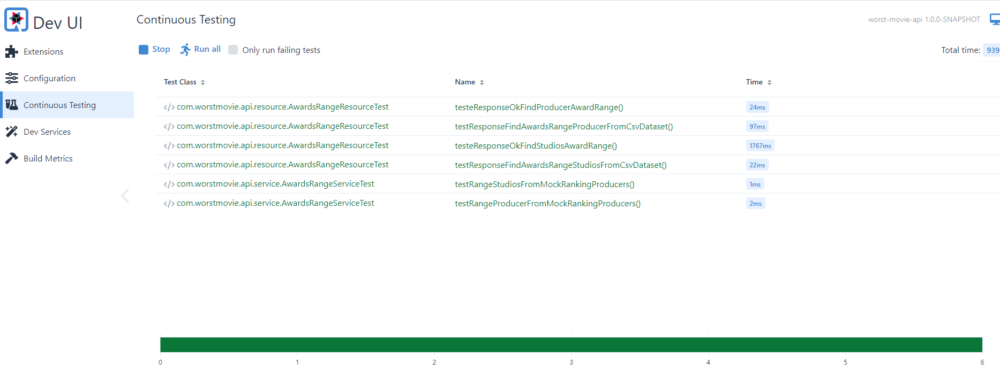
- Os testes presentes na classe AwardsRangeResourceTest testam se as rotas do AwardsRangeResourceAPI retornam requisição realizada com sucesso (status 200) ao acessar seus endpoints. Além disso também realizam testes comparando se os resultados das faixas de prêmios presentes no arquivo CSV importado ao iniciar a aplicaçao são iguais ao mocks que foram criados na classe para realizar essa comparação. Reforço que **alterações** no arquivo CSV tem grandes chances de provocar falhas nos testes dessa classe. Sabendo disso em seguinte irei explicar os testes na classes de AwardsRangeServiceTest, que possibilitam uma flexibilidade maior de testes.
- Os testes presentes na classe AwardsRangeServiceTest fazem um mock de um rank de faixa de prêmios e compara o resultado5 com outro mock. Dessa forma podemos montar qualquer cenário de teste.
- Para executar o teste via IntelliJ IDEA, entre na classes de teste e clique no botão conforme imagem de exemplo:
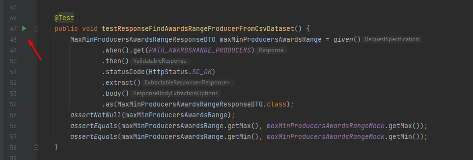
- Para executar os testes via comando, abra o terminal do gitBash nas raiz do projeto execute o comando: **mvn clean install -DskipUnitTests**
- O resultado pode ser verificado conforma imagem
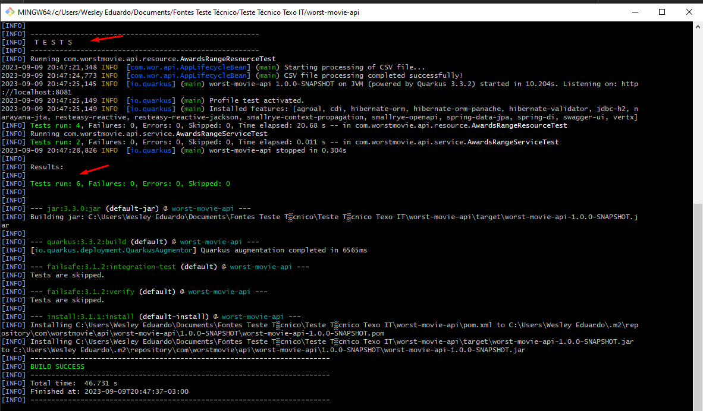
- Os testes presentes no pacote security verificam se determinados endpoints estão acessíveis ou não dependendo da configuração de autenticação repassada no teste da requisição.

# Observações Gerais Importantes

- As regras de desenvolvimento da API citam a criação de uma API RESTFUL, e por isso alguns endpoins adicionais foram criados para se aproximar desse padrão. Abaixo farei uma breve descrição sobre os recursos adicionais criados.
- Os detalhes dos endpoints adicionais podem ser analisados no link do Swagger: http://localhost:8080/q/swagger-ui/
- Após desenvolver a rota que retorna "O produtor com maior intervalo entre dois prêmios consecutivos, e o que obteve dois prêmios mais rápido (GET /api/v1/awardsrange/producers), tive a curiosiade de identificar também quais seriam os Studios com maior intervalo entre dois prêmios consecutivos, e o que
  obteve dois prêmios mais rápido (GET /api/v1/awardsrange/studios. A lógica referente a essa rota de faixa de prêmios para studios foi criada com facilidade pois da forma que foi implementada é possível criar outras cenários de forma simples, como por exemplo: Quais seriam os piores Roteiristas premiados? E assim por diante. Essas 2 rotas são representadas conforme abaixo: 
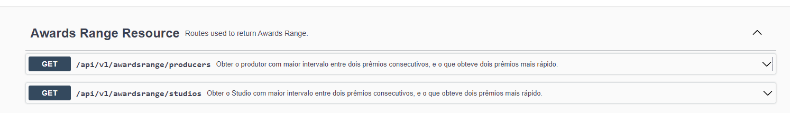
- Os recursos para Produtores, Studios e Piores Filmes contém as rotas para operações de CRUD. O objetivo aqui foi inserir característas de HATEOAS nas rotas de listagem geral e busca por ID. Um resumo dessas rotas está conforme imagem abaixo:
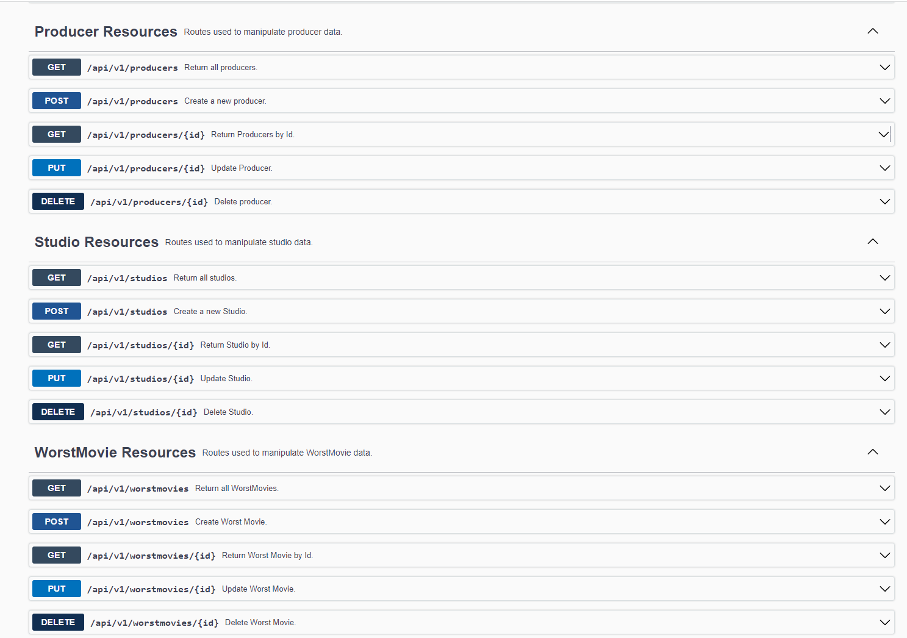
- A implementaçãao do HATEOAS foi realizada de forma básica, podendo ser melhorada conforme espeficiação presente na documentação do Quarkus: https://quarkus.io/guides/resteasy-reactive#web-links-support
- IMPORTANTE! Operações realizadas nesses endpoints adicionais tais como update, create e delete podem afetar os testes nos endpoints que retornam as faixas de prêmios, pois o cenário principal de testes solicitado no arquivo de especificações do desafio considera os dados presentes no arquivo CSV que foi lido ao iniciar a aplicação. Caso sejam adicionados/alterados/removidos dados, o teste sobre as faixas de prêmios devem ser realizados considerandos essas alterações. 
