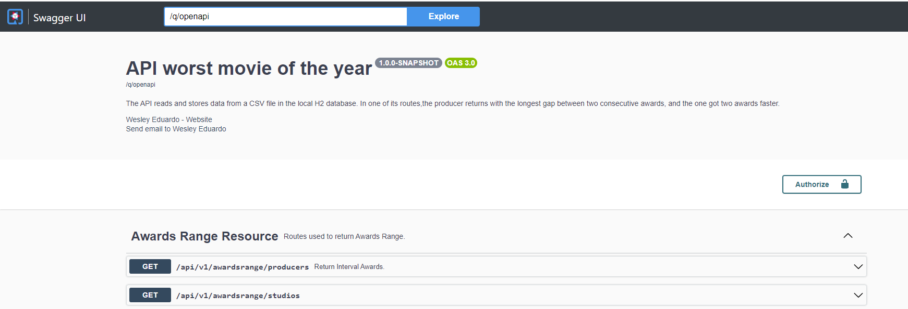

# Desafio Técnico API REST - Pior Filme do Golden Raspberry Awards

- Essa API permite utilizar uma base importada de um arquivo CSV para gerar e disponibilizar dados
sobre indicados e vencedores do referido prêmio.

- Um dos principais objetivos dessa API é obter o produtor com maior intervalo entre dois prêmios consecutivos, e o que
  obteve dois prêmios mais rápido. A aprensentação desses dados seque a especificação no arquivo src/main/resources/Especificação Backend.pdf.

# Características da API

- API desenvolvida usando Quarkus Framework na versão 3.3.2
  - A estrutura inicial do projeto foi gerada pelo START CODING do quarkus (https://code.quarkus.io/)
- Ao iniciar a aplicação, o arquivo CSV presente no diretório src/main/resources/movielist.csv é lido, processado e seus dados são armazenados no banco de dados.
- Utilização de SGBD embarcado H2
- Documentação com Swagger
- Disponibilização de rota para obter o produtor com maior intervalo entre dois prêmios consecutivos, e o que
  obteve dois prêmios mais rápido.

# Tecnologias necessárias para execução do projeto

- Java - Versão 11. Disponível em: https://docs.aws.amazon.com/corretto/latest/corretto-11-ug/downloads-list.html
- Maven - Versão 3.9.4. Disponível em: https://dlcdn.apache.org/maven/maven-3/3.9.4/source/apache-maven-3.9.4-src.zip
- Se necessário, A SDK do java e o Maven usados para execução da aplicação estão disponíveis no link: https://drive.google.com/drive/folders/1YlBRBejkEQ1FW5CJEUrov1tkdmFIC4_p?usp=sharing

# Passos para executar o projeto utilizando linhas de comandos (Ambiente Windows)

- O primeiro passso aqui é ter o Java e o Maven configurados nas variavéis de ambiente do windows.
- Acesse as configurações de variáveis de ambiente
- 
- 
- Na parte de variáveis do sistema, clique em novos e configure os diretórios da seguinte forma:
- 
- Faça uma edição no Path para configurar o bin:
- 
- 
- Clique em OK em todas as telas para encerrar a configuração
- Para testar a configuração do Java abra o cmd e digite: java -version
- 
- Para testar a configuração do Maven abra o cmd e digite: mvn
- 
- Agora vamos executar alguns comandos para executar a aplicação
- Abra o diretório raiz do projeto e abra um terminal do GitBash por exemplo. https://git-scm.com/downloads
- 
- 
- Execute o comando mvn clean install para gerar o build completo da aplicação, inclusive com os testes.
- 
- Devemos ter o seguinte resultado:
- 
- Para finalmente iniciar a aplicação. Execute o seguinte comando: ./mvnw compile quarkus:dev
- Temos como resultado:
- 
- Utilize o seguinte link acessar o Dashboard do Quarkus: http://localhost:8080
- Link do Swagger http://localhost:8080/q/swagger-ui/
- 
- 

# Passos para executar o projeto utilizando IntelliJ IDEA no idioma inglês

- Clonar o projeto worst-movie-api em algum diretório na máquina. (Para essa aplicação foi usado Windows como ambiente de desenvolvimento)
- Baixar e instalar versão gratuita IntelliJ IDEA Ultimate por 30 dias. https://www.jetbrains.com/idea/download/?section=windows
- Ao iniciar a IDE, selecionar a Opção File -> Open
- 
- Procure e selecione o diretório onde o projeto foi clonado:
- 
- Para configurar o Java selecione a opção File -> Project Structure
- 
- Na aba project, opção SDK procure e selecione a SDK do Java 11
- 
- Para configurar o maven, selecione a opção File -> Settings
- 
- Pesquisar por maven e configure conforme imagem
- 
- Na aba do maven na parte superior da lateral direita, execute o clean e install para baixar as dependências do projeto.
- 
- Após finalizar com sucesso essa ação. na parte superior da lateral direita, clique no botão para executar o projeto:
- 
- Utilize o seguinte link acessar o Dashboard do Quarkus: http://localhost:8080 
- Link do Swagger http://localhost:8080/q/swagger-ui/
- - 
- 